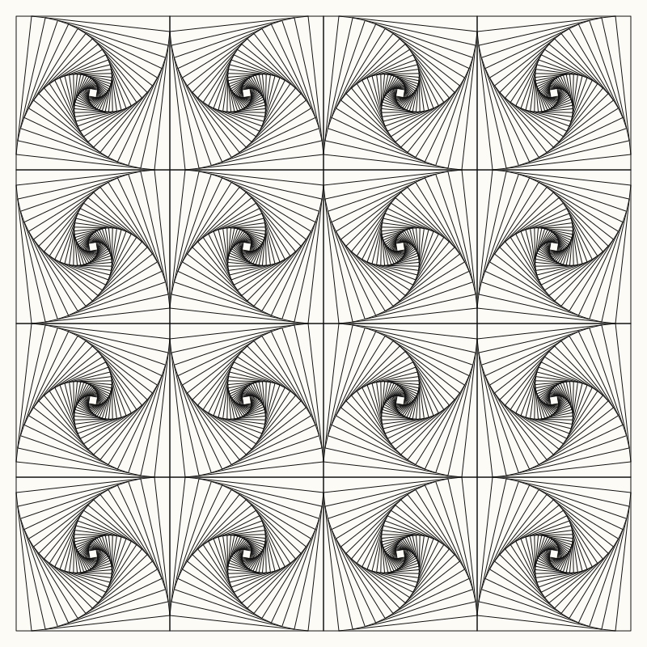

# zentangles

Drawings made with code. Pure Python (stdlib only), output as SVG.

## Web gallery

`web/` is an interactive gallery: pick a painting, tweak its variables with a
live preview, and read or edit its drawing code in the browser. No build step —
open `web/index.html` directly or serve the folder:

```bash
python -m http.server -d web 8000   # http://localhost:8000
```

Each painting is one file in `web/paintings/` that calls `Gallery.register`
with an `id`, `title`, `description`, a `params` schema (`range`, `checkbox`,
`color`) and a `draw(p, pen)` function. Add a `<script>` tag for it in
`web/index.html` and it shows up in the gallery. A painting may also set
`style` (`ink`, `paper`, `strokeWidth`) to override the default look.

The `pen` API offers `polygon`, `polyline`, `line`, `circle`, `arc` and `path`;
each accepts an optional `{ fill, stroke, width }` style. `pen.random(seed)`
returns a deterministic random generator. Code edits are saved in the browser
(localStorage) and can be reset at any time.

The studio also offers Randomize, shareable links (the variables live in the
URL hash, e.g. `#/paradox?n=3&alternate=0`), SVG/PNG export and arrow-key
navigation between paintings.

Current paintings: Paradox, Paradox Circle, Triangle Paradox, Honeycomb
Paradox, Spider Web, Truchet Tiles, Scales, String Art, Bulge Checker, Polar
Checker and Op Waves.

## Paradox grid (Python CLI)

The canvas is split into an `n x n` grid and every cell gets a **Paradox**
tangle: starting from the square, each new line begins where the previous one
ended and lands a small fraction (`--ratio`) along the next side. The nested,
rotating squares create the illusion of curves. Neighbouring cells spin in
opposite directions (checkerboard) so the curves flow across cells.



```bash
python -m zentangles --n 4 -o output/paradox.svg
python -m zentangles --n 6 --steps 40 --ratio 0.08
python -m zentangles --n 3 --no-alternate
```

| Option | Default | Meaning |
| --- | --- | --- |
| `--n` | 4 | Grid size |
| `--canvas` | 800 | Canvas size (px) |
| `--margin` | 20 | Outer margin (px) |
| `--steps` | 30 | Nested lines per cell |
| `--ratio` | 0.1 | How far along each side the next line lands |
| `--no-alternate` | off | Spin every cell the same way |
| `--stroke-width` | 1.0 | Line width |
| `-o` | `output/paradox.svg` | Output file |

## Tests

```bash
python -m unittest
```
